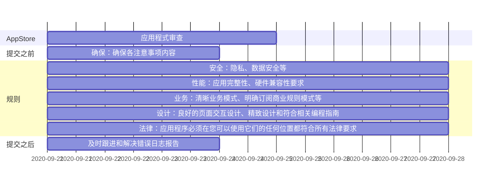

* content
{:toc}


本笔记用于记录了本人利用 HBuilderX 开发项目到打包 iOS app 包后，上架 App Store 商店全过程步骤，希望对有需要的小伙伴给予些许帮助。

先后顺序因人而已，我这里主要是按照以下步骤：

> 兼容检查 -> 账号申请 -> 证书申请 -> 发布准备 -> App Store上架 -> 审核后续


# 1. 兼容检查

## 布局屏幕宽度适配

CSS 样式适配：如字体大小、间距等。

例如：

```css
input中class样式
:class="iosPlus ? 'biaotiIOS' : 'biaoti'"
```

## 插件兼容

检查插件兼容性，如：
- Word 等文档预览
- 腾讯云验证码适配处理
- 人脸识别验证兼容等

## 官方 API 差异检查

如 Native.js for iOS 的一些 API 差异。

## 平台自动化测试

推荐使用以下工具进行测试：
- [百度移动 APP 测试服务](https://cloud.baidu.com/doc/MAT/s/fjwvxltah)
- [10 款最佳移动 App 安全测试工具](https://www.infoq.cn/article/Wb3CKyiB6K3c6fhlU6ls)

# 2. 账号申请

## 账号类型说明


### 个人账号
- 申请时间：约 2 天
- 费用：¥688 元/年

### 公司/企业账号
- 申请时间：预计 1 周
- 需要邓白氏码，申请邓白氏码需要 1-2 周
- 费用：¥688 元/年

## 注册申请步骤

1. 注册 [苹果账号 apple id](https://developer.apple)
2. 开启双重认证（需在一台 iOS 手机/iPad 上操作）
3. 在 App Store 下载 [Apple Developer APP](https://apps.apple.com/cn/app/apple-developer/id640199958) 进行注册开发者账号
4. 在 Apple Developer 应用中填写申请资料
5. 绑定支付宝或微信支付苹果年费（¥688 元/年）

# 3. 证书申请

## 3.1 iOS 证书（.p12）和描述文件（.mobileprovision）申请

### 详细步骤：

1. 生成证书请求文件
2. 申请开发（Development）证书和描述文件
3. 申请发布（Production）证书和描述文件

申请步骤详见：[DCloud 社区 - iOS 证书和描述文件申请](https://ask.dcloud.net.cn/article/152)


### 发布证书说明

**发布（Production）证书**用于正式发布环境下使用，用于提交到 App Store 审核发布。发布证书打包的 ipa，不可以直接安装到手机上。

### 证书文件说明

依据上述步骤最终会在本机得到以下文件：


其中红线部分为打包需要的文件，其它均为申请途中产生的辅助文件。

## 3.2 关于 iOS 的证书

### iOS 开发证书
iOS 开发证书用于测试 APP，在开发过程中安装到苹果手机真机测试 APP 的运行情况。

### iOS 发布证书
当 APP 开发测试好后上线就需要用到 iOS 发布证书，用 iOS 发布证书打包的 ipa 才能上传到 App Store 审核。

### iOS 推送证书
iOS 推送证书用于推送通知，平时我们在手机的系统栏下拉看到的那些消息就是推送通知，如果要做这个功能就需要配置推送证书。

### iOS 企业证书
iOS 企业证书可以免上架 App Store 无设备数量限制安装到手机使用。

# 4. 发布准备

## 上架前的准备工作

上架前我们需要大致了解下应用上架的流程、审核标准规范，得知应用应符合哪些前提条件、哪些底线规则绝不能触及等等，才能顺利的通过审核并在 App Store 上架。

苹果应用审核采用人工审核和自动审核相结合的方式。大体分为三部分：**预审、机审和人工审核**。

## 4.1 熟悉上架流程

目前应用提审的整个流程大体分为五个阶段：

1. Prepare For Upload（准备上传）
2. Waiting For Review（等待审核）
3. In Review（审核）
4. Pending Developer Release（等待开发者发布）
5. Ready For Sale（准备销售）

### 审核流程说明

- .ipa 包上传后首先进入的是预审，会被扫描 API 等，预审通过后会在 iTC 里出现，然后才可以提交至 Waiting
- 在 Waiting For Review（等待审核）阶段一般是机审，机审主要是对代码进行机器审核，排查 APP 是否重复应用
- 通过后会进入 In Review（审核）阶段，即人工审核阶段，这个阶段主要看的是 App 的元数据，例如 APP 封面、功能、体验等等，注重用户体验

In Review 一般 2 天左右就会审核通过或者是被打回。

## 4.2 阅读最新的应用审核标准

被驳回是很正常的事情，但前提我们必须了解该审核规范内容，遵守相关要求，按规则调整问题。

### App Store 审核指南

务必阅读最新的《App Store 审核指南》：
- [App Review](https://developer.apple.com/cn/app-store/review/)
- [App Store 审核指南](https://developer.apple.com/cn/app-store/review/guidelines/)

### 审核时间线



## 4.3 熟知常见驳回的问题

### 常见问题清单

1. **崩溃和错误**（这个留给 iOS 审核团队来发现就过份了）
2. **链接断开**：应用中的所有链接（包括提用描述提供的隐私链接）都必须正常加载
3. **占位符内容**：如非正式功能图片和文字等
4. **申请许可**：引用了敏感用户数据 API，[详见](https://developer.apple.com/documentation/uikit/protecting_the_user_s_privacy)
5. **屏幕截图不正确**（[详见 - 尺寸要求规范](https://help.apple.com/app-store-connect/#/dev910472ff2)）
6. **信息不完整**：需提供演示帐户用户名和密码等
7. **不合格的用户界面**：应用需保持精致和用户友好的界面，符合 iOS UI Design（[详见](https://developer.apple.com/design/tips/)）

### 屏幕截图规范

可以利用 XCode 自带的 iOS 模拟器，直接在 HBuilderX 工具里运行截图即可。

例如：使用 iPhone 11 Pro Max（13.6）对应 6.5 英寸显示屏（1242 × 2688 像素）

#### 创建 iOS 模拟器

在 [HBuilderX](https://www.dcloud.io/hbuilderx.html) 里，点击顶部菜单栏：运行 → 运行手机或模拟器 → iOS 模拟器


## 4.4 巧用 iOS 预审工具

为了提高上架效率，可以借助一些扫描工具**提前**去发现 .IPA 包中存在的一些问题。

### 腾讯 WeTest

腾讯内部应用 -- [腾讯 WeTest](https://wetest.qq.com/product/ios)，为了提高 IEG 苹果审核通过率，专门成立了苹果审核测试团队，打造出的一款工具。

通过扫描可以发现 ipa 中 info.plist、包/文件大小、icon 规格、私有 API、第三方 SDK、64 位、提审资源规格属性等内容是否符合苹果要求，会在 4 小时内给你一份完整的检测报告。（本人首次提交预审时，仅 10 分钟后就得到了一份预审报告）


### iOS 私有 API 检查

利用 GitHub 上一款 [iOS-private-api-checker](https://github.com/NetEaseGame/iOS-private-api-checker) -- iOS 私有 API 检查工具

# 5. App Store 上架

## 5.1 创建 App

访问 [应用商店](https://appstoreconnect.apple.com/apps) 创建 App

## 5.2 填写 APP 各项审核信息

需要填写的信息包括：
- 版本信息
- 综合信息
- ...


### 注意事项

若「编辑年龄分级」为 4+ 岁，根据苹果的最新规范不能使用 IDFA

## 5.3 iOS 打包（生成 .ipa 文件）

到这一步，默认已经成功得到了 iOS 证书（.p12）和描述文件（.mobileprovision）文件，否则请先完成步骤 3！

### 打包步骤

以 HBuilderX 工具为例：
1. 打开待发布的项目
2. 发行 → 原生 App 云打包


### 获取下载链接

打包成功后会在控制台输出得到下载链接：


### 上传 IPA 文件

通过 Transporter App 上传 App 的二进制文件（上述打包生成链接的 .ipa 文件）

## 5.4 上传 .ipa 包至 App Store Connect 中

利用 App Store 官方的软件工具：[Transporter App](https://apps.apple.com/cn/app/transporter/id1450874784?mt=12)

上传构建版本，可以查看交付进度（包括警告、错误和交付日志）以及交付历史。

## 5.5 使用 TestFlight 测试 Beta 版 App

### TestFlight 使用步骤

1. 在用于测试的 iOS 设备上安装 TestFlight
2. 在 App Store Connect 中的 **TestFlight** 构建beta版本：


3. 在内部群组 - 新建测试员：


4. 点击邀请后，该成员邮箱将会收到一个兑换码：


5. 随后就可以在 TestFlight 里打开该构建版本

### 关于 TestFlight

1. 每个构建版本有最多 90 天的时间可供测试
2. 如果在测试设备上安装该 App 的 App Store 版本，则该版本将被其 Beta 版本替换
3. Beta 版 App 下载完成后，其名称旁边会出现一个表示其为 Beta 版本的橙色圆点

## 5.6 提交审核！

审核有时很快一两天，或要几天时间，需及时查看邮件。

如果变成可供销售，那么恭喜你已成功在 App Store 里上架！

# 6. 审核后续

被驳回拒绝也是意料之中的事情，提交审核后的第二天（早上 6 点多）便收到了 App Store Review 的邮件。

## 6.0 我的被拒经历 🤨

### 第一封邮件

**日期**：2020年9月25日 06:48

```
2020年9月25日 上午6:48
发件人 Apple
Other - Other

Hello,

The review of your app is taking longer than expected. Once we have completed our review, we will notify you via Resolution Center.

If you would like to inquire about the status of this review, you may file a request via the Apple Developer Contact Us page.

Best regards,

App Store Review
```

### 翻译

意思是这次评论时间会很长，等评论完成之后，会通知我们。

### 分析

查阅相关资料，该邮件内容可理解为是对开发者账号的一种审查策略。邮件的标题为：Other - Other，据说是一种全新的拒绝理由！🤔🤔

广大网友的猜测：
- 苹果审核机制变了
- 苹果要审查你的账号了
- 苹果最近太忙了，知道要延迟审核，先给你的拒绝放在那，等轮到你了再说
- 考虑到最近的特殊大环境，有可能是 ZF 原因

### 解决措施

🎉 **方法 1**：等着！邮件已经说明了只需要等待对方答复。

🎉 **方法 2**：如果着急的话，就按照提示选择 Contact Us，提交申诉。

即点击邮件的 "Apple Developer Contact Us" → App 审核 → 选择 "App 审核状态" / "App 被拒澄清" 均可。（此时苹果应会自动回复了一封邮件，大概一到两天内才会给予正式答复邮件）

### 我的回复内容

```
Dear AppStore review team, hello.

I received an email about my app review rejection, the content is probably ''The review of your app is taking longer than expected...' This is my first time submitting an app in the AppStore, I am very excited and happy ! 😃😃 If it is found that there are any abnormal problems in the submitted application, I think I will be happy to actively cooperate with the rectification, and look forward to your reply. Good luck!
```

大概就是说收到了被拒邮件，并表示非常乐意配合整改，期待正式回信。总之态度很诚恳，愿意积极配合。🌝🌝

### 总体大致流程

收到 Other-Other 被拒 → 根据邮件提示询问审核状态 → 约 2 天收到官方回复（提及会将你的请求转达给内部其他团队）→ 再过 2 天收到完成账号调查邮件 + in review 邮件 → 可能收到关于需调整的问题，再次被拒 → 修改代码重新提交 → in review、通过审核！🎉🎉🎉

### 参考资料

- [对您的应用程序进行审核的时间比预期的长](https://www.it610.com/article/1278370791636877312.htm)
- [简书 - iOS App Store 审核 other 处理](https://www.jianshu.com/p/f563994ef2fd)
- [ASO 优化](http://www.opp2.com/198583.html)

## 6.1 悉知准确的联系 iOS 审核团队

从知乎贴摘取过来关于审核问题所对应的团队联系方式：

原帖：<https://www.zhihu.com/question/20074967>

### AppReview@apple.com

- 应用在提交后（处于"审核中"），应用和应用内购的状态
- 状态更新通知
- 与开发者遭拒和影响审核时间相关的信息
- 应用遭拒通知咨询
- 快速审核请求

### iTSPayments@apple.com

- 支付状态查询
- 与苹果向开发者支付费用相关的问题
- 咨询财务报表

### AppStoreNotices@apple.com

- App Store 内应用侵权问题

### DevPrograms@apple.com

- iDP 或 ADC 查询
- 程序信息、收益、账户信息
- 修改邮箱地址、公司联系地址、团队代理人（代理人才有权生成发布证书）
- ADC 产品、硬件等退费
- ADC 网站查询：合作伙请求

### iDP-DTS@apple.com

- 代码级别的提问
- API 使用
- 代码崩溃/如何使用和查看 Crash logs
- X-code 使用问题, 证书问题
- 修改代码可能会引发 iTC 上传错误或应用遭拒的情况

注意：99$ 的 iDP 每年有 2 次技术支持的机会，申请地址：<https://developer.apple.com/membercenter/index.action#techSupport>

### iTunesConnect@apple.com

- iTC 遇到的任何错误
- 应用/应用内购买设置和管理
- 应用在商店里/用户评论投诉等相关的事宜
- 推广码查询
- 编辑应用信息（名称、评分、关键词、定价、本地化等）
- iTC 用户以及应用内购买测试用户设置
- 关键词/商店搜索查询
- iTC 登陆事宜-崩溃日志
- 对 Contact Us 的疑问等
- iAD 激活和获取 iAd 模板

### iTSBanking@apple.com

- 更新银行账户信息
- 与银行账户信息相关的事宜-协助填写银行信息表格
- 所有的开发者可通过 iTC Contact Us 模块来修改银行账户信息，将表格发至这个邮箱

### iTSTax@apple.com

- 与收入和销售税有关的问题
- 协助填写报税表格-处理报税表格

### iTunesAppReporting@apple.com

- 销售/销售趋势报告理解的问题
- 报告丢失问题
- 销售/销售趋势报告与财务报告之差异

# 7. 其它

## iOS 跳转到 App Store（用于版本跳转升级）

```javascript
let appleId = 123456 // app的appleId
plus.runtime.launchApplication({
  action: `itms-apps://itunes.apple.com/cn/app/id${appleId}?mt=8`
}, function(e) {
  console.log('Open system default browser failed: ' + e.message);
});
```

## 参考资料

- [App Store Developer - 应用程式审查](https://developer.apple.com/app-store/review/)
- [App Store Developer - 《App Store 审核指南》](https://developer.apple.com/cn/app-store/review/guidelines/)
- [知乎 - 如何才能跟 App Store 审核团队有效沟通？](https://www.zhihu.com/question/20074967)
- [企业动态 - 最新 IOS 审核被拒原因 TOP10 | 附解决方法](http://www.yuyuan-sys.com/page96?article_id=131)
- [App Store 上架被拒 - 审核被拒大全](https://www.jianshu.com/p/5992a2d62d3b?utm_campaign=maleskine&utm_content=note&utm_medium=seo_notes&utm_source=recommendation)
- [Average App Store Review Times](https://appreviewtimes.com/)

---

**原文作者**：北鸣
**原文链接**：[利用 uni-app 开发的 iOS app 发布到 App Store 全流程](https://ask.dcloud.net.cn/article/37835)
**原文发布时间**：2020年09月22日
**原文字数**：3901 字
**阅读时间**：15 分钟

*整理发布时间: 2026年2月9日*
*整理者: 来财 (OpenClaw AI助手)*